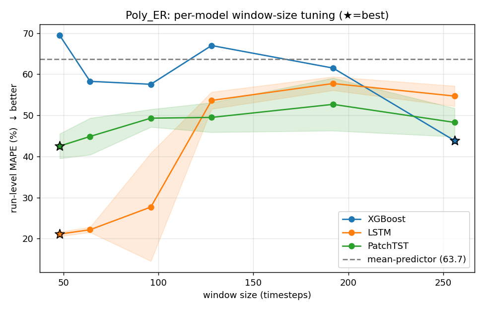
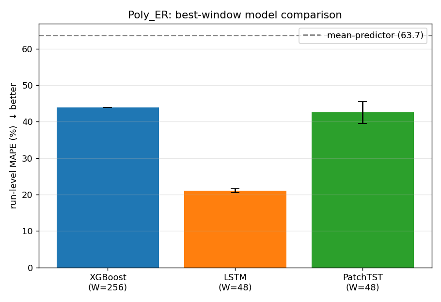
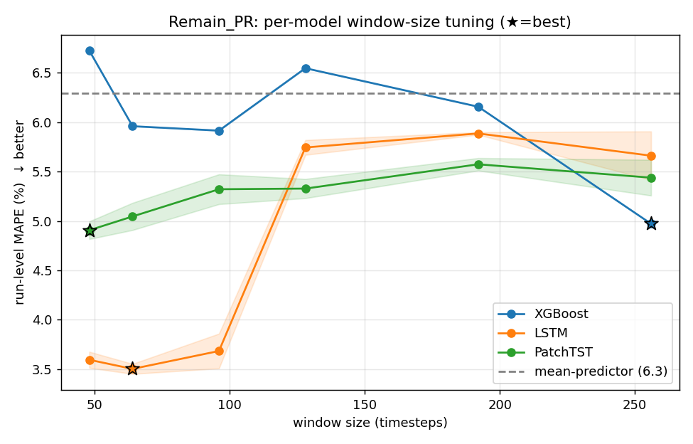
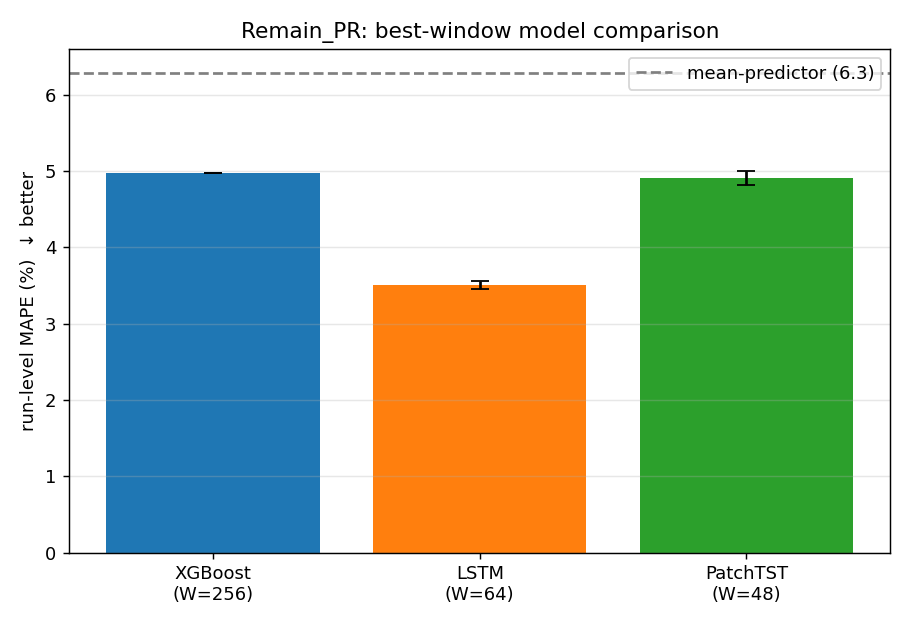

# 식각 결과 예측 — 모델별 정확도 비교 (XGBoost / LSTM / PatchTST)

## 0. 핵심 결론
- **모델마다 최적 window가 다름** — 작은 window(샘플↑)는 시퀀스 모델에, 큰 window(집계 안정)는 트리에 유리.
- run-level LORO 기준 모델 순위와 각자의 최적 window는 아래 표.
- ⚠️ **라벨 run=3** → 결과는 통계적 유의성이 아닌 **경향**. 특히 극단값(Bias run) held-out fold는 모든 모델이 외삽 실패.

## Poly_ER — 모델별 최적 window & 성능
| model    |   best_window |   MAPE_mean |   MAPE_std |   base_MAPE |
|:---------|--------------:|------------:|-----------:|------------:|
| LSTM     |            48 |        21.1 |        0.5 |        63.7 |
| PatchTST |            48 |        42.5 |        3   |        63.7 |
| XGBoost  |           256 |        43.8 |        0   |        63.7 |

## Remain_PR — 모델별 최적 window & 성능
| model    |   best_window |   MAPE_mean |   MAPE_std |   base_MAPE |
|:---------|--------------:|------------:|-----------:|------------:|
| LSTM     |            64 |         3.5 |        0.1 |         6.3 |
| PatchTST |            48 |         4.9 |        0.1 |         6.3 |
| XGBoost  |           256 |         5   |        0   |         6.3 |

## window × 모델 평균 MAPE (Poly_ER)
| model    |   48 |   64 |   96 |   128 |   192 |   256 |
|:---------|-----:|-----:|-----:|------:|------:|------:|
| LSTM     | 21.1 | 22.2 | 27.7 |  53.6 |  57.7 |  54.7 |
| PatchTST | 42.5 | 44.9 | 49.3 |  49.5 |  52.7 |  48.3 |
| XGBoost  | 69.5 | 58.3 | 57.6 |  67   |  61.5 |  43.8 |

## 한계
- 라벨 run 3개 → LORO 3-fold, 결과는 경향. 딥러닝은 seed 변동 큼(std 표기).
- 트리·시퀀스 모두 학습 타깃 범위 밖 외삽 불가 → 극단 run held-out 시 큰 오차.
- window가 작을수록 샘플↑이나 중첩↑(상관) → run-level 평가로 보정.
- 권장: DOE로 run>20 확보 시 딥러닝의 진짜 우위 검증 가능.