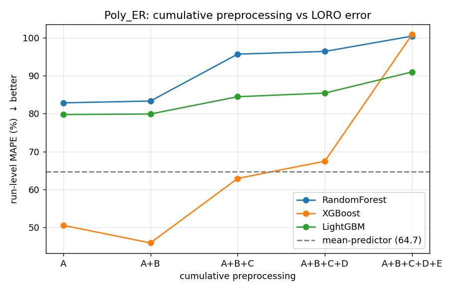
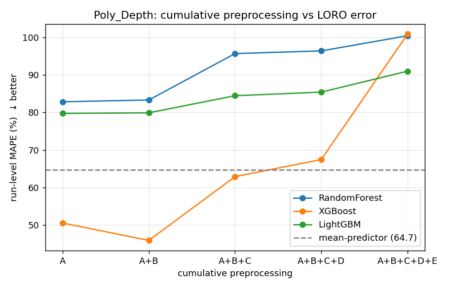
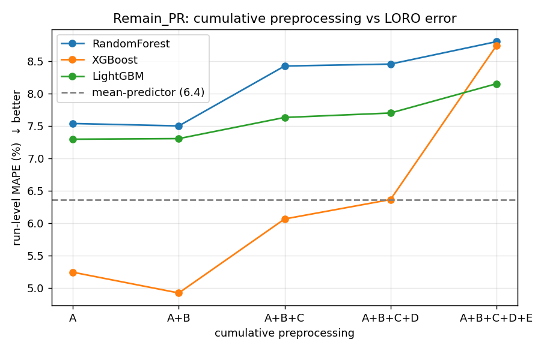
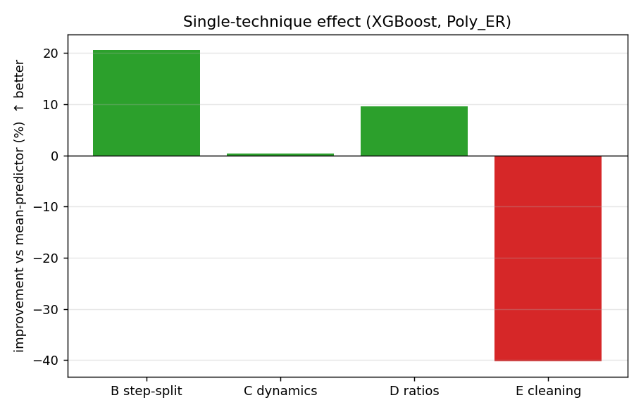
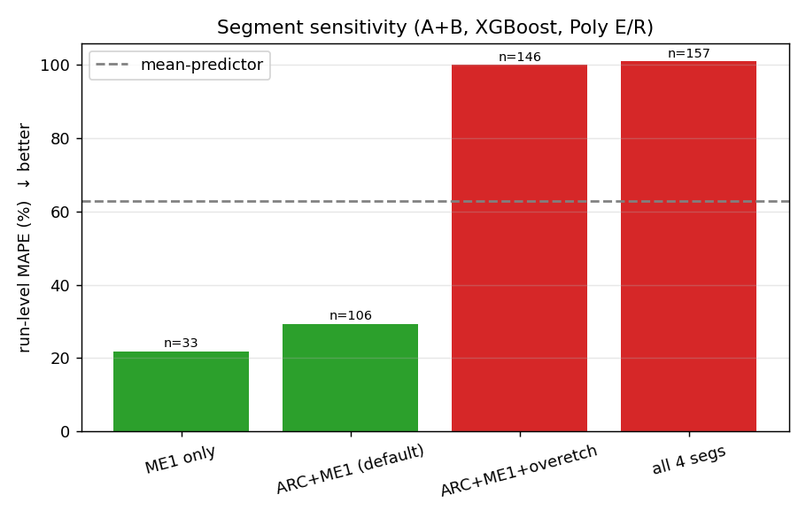

# 식각 공정 결과 예측 — 전처리 전략 비교 결과

## 0. 최종 베스트 파이프라인
**ME1 단독 window + 튜닝 XGBoost(n=400, depth=3, lr=0.1)**
| target     |   run_MAPE |   base_MAPE |   improve_% |
|:-----------|-----------:|------------:|------------:|
| Poly_ER    |       21.9 |       59.46 |       63.17 |
| Poly_Depth |       21.9 |       59.46 |       63.17 |
| Remain_PR  |        3.5 |        5.96 |       41.25 |

## 1. 요약 (핵심 결론)
- **Step(ARC/ME1) 분리(B)가 가장 효과적인 전처리** (단독 +21%).
- **C/D/E 를 더할수록 악화** — n=3 에서 feature 과다 → 과적합 → held-out run 외삽 실패.
- **식각 본구간(ME1)만 사용**할 때 가장 정확 (ARC·overetch·stable 은 노이즈).
- 모델은 **XGBoost** 가 압도적, 튜닝으로 Poly E/R MAPE 46→22% 개선.

## 2. 누적 전처리 단계별 (Poly E/R, 3모델 평균)
| prep      |   run_MAPE |   base_MAPE |
|:----------|-----------:|------------:|
| A         |      71.03 |        64.7 |
| A+B       |      69.7  |        64.7 |
| A+B+C     |      80.99 |        64.7 |
| A+B+C+D   |      83.07 |        64.7 |
| A+B+C+D+E |      97.38 |        64.7 |

## 3. 단독 기법별 효과 (XGBoost, Poly E/R, baseline 대비 %)
| prep      |   improve_vs_base_% |
|:----------|--------------------:|
| A+B(only) |                20.7 |
| A+C(only) |                 0.4 |
| A+D(only) |                 9.5 |
| A+E(only) |               -40.2 |

기법 기여도: **B(step분리) > D(비율) > C(변화량) ≫ E(이상치처리, 역효과)**

## 4. 하이퍼파라미터 튜닝 (전처리=A+B, target=Poly_ER)
| model        |   run_MAPE | params                                                           |
|:-------------|-----------:|:-----------------------------------------------------------------|
| LightGBM     |      83.99 | {'n_estimators': 200, 'num_leaves': 15, 'learning_rate': 0.1}    |
| RandomForest |      71.97 | {'n_estimators': 200, 'max_depth': None, 'max_features': 'sqrt'} |
| XGBoost      |      29.01 | {'n_estimators': 400, 'max_depth': 3, 'learning_rate': 0.1}      |

→ XGBoost 만 baseline(64.7) 을 큰 폭으로 하회.

## 5. Segment 민감도 (A+B, XGBoost, Poly E/R)
| seg_set           |   n_windows |   run_MAPE |   base_MAPE |
|:------------------|------------:|-----------:|------------:|
| ME1 only          |          33 |      21.9  |       59.46 |
| ARC+ME1 (default) |         106 |      29.36 |       64.7  |
| ARC+ME1+overetch  |         146 |      99.94 |       63.18 |
| all 4 segs        |         157 |     100.75 |       63.58 |

→ **ME1 단독이 최고.** ARC(반사방지막 식각)·overetch·stable 은 poly 결과와 무관해 노이즈로 작용.

## 6. 한계 (반드시 함께 읽을 것)
- **라벨 run = 3개.** window(106개)는 feature 용이며 독립표본 아님 — 라벨은 run 당 1개.
- LORO 3-fold → 결과는 **통계적 유의성 아닌 경향**.
- 트리는 학습 타깃범위 밖 외삽 불가 → held-out 극단값이면 큰 오차.
- Poly E/R = Poly Depth × 7.5 (식각시간 80s 고정) → 두 타깃은 동일 예측문제.
- **권장:** DOE 로 run>20 확보 시 본 파이프라인 그대로 정식 벤치마크 가능.